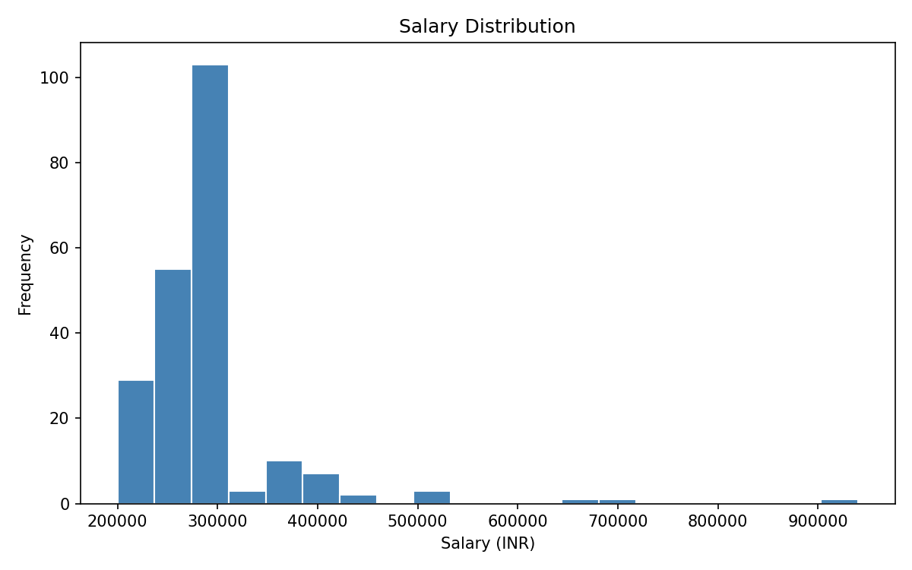
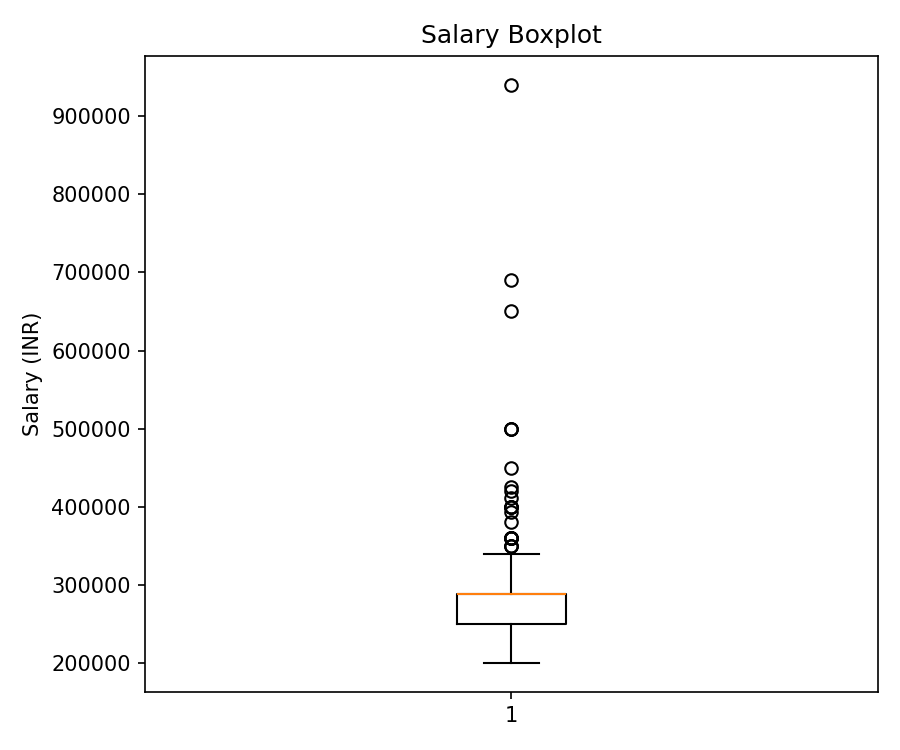
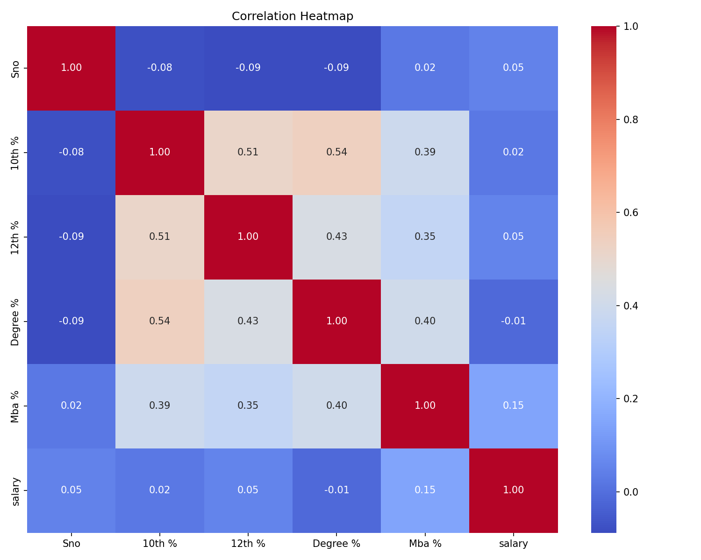
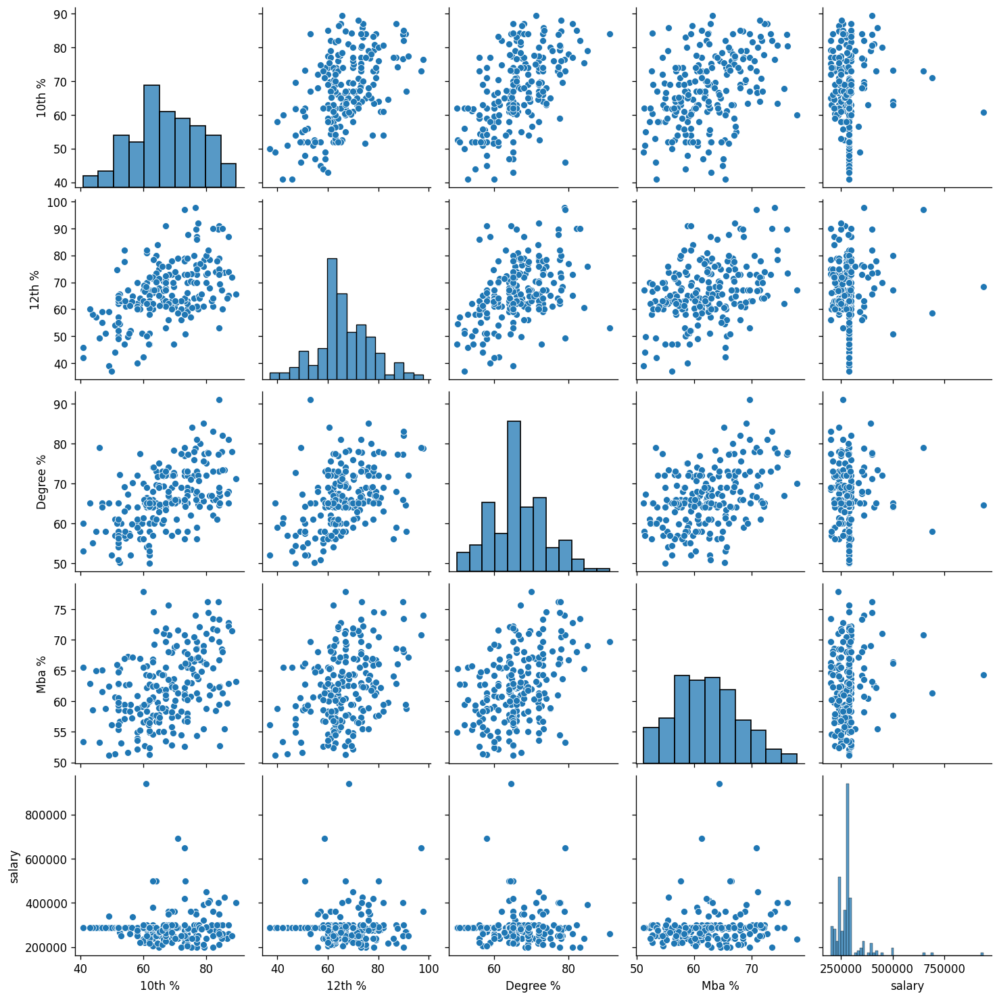
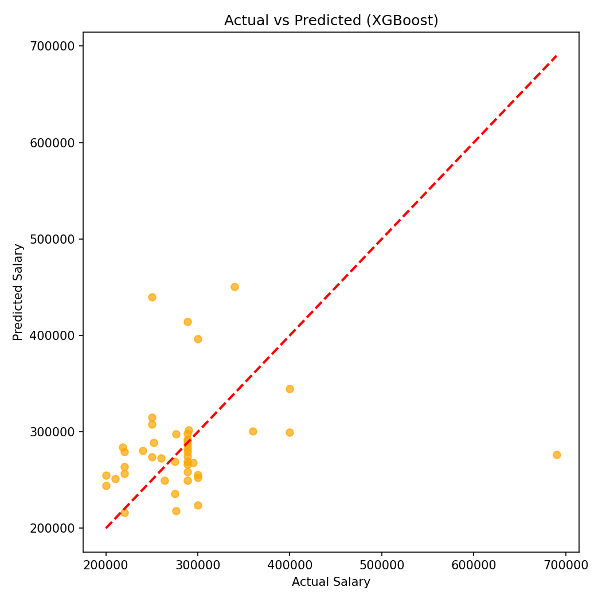
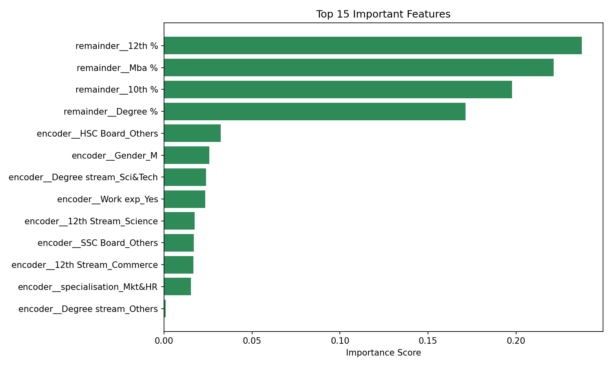

# 🎓 Campus Placement Salary Prediction ML

[](https://python.org)
[](https://colab.research.google.com/)
[](https://xgboost.readthedocs.io/)
[](LICENSE)
[]()

**An end-to-end Machine Learning project that predicts MBA student salaries using Linear Regression, Decision Tree, Random Forest, and XGBoost — with full EDA, feature engineering, model evaluation, cross-validation, and feature importance analysis.**

[📓 Open Notebook](#-how-to-run-in-google-colab) · [📊 View Results](#-model-results--comparison) · [🧠 What You Learn](#-what-we-learn)

</div>

---

## 📌 ML Pipeline

```
┌─────────────────────────────────────────────────────────────┐
│                    DATASET LOADING                          │
│         215 students × 14 columns (CSV)                     │
└────────────────────────┬────────────────────────────────────┘
                         │
                         ▼
┌─────────────────────────────────────────────────────────────┐
│              EXPLORATORY DATA ANALYSIS (EDA)                │
│  ├── 📊 Salary Distribution Histogram                       │
│  ├── 📊 Academic Score Distributions (5 plots)              │
│  ├── 📦 Salary Boxplot (outlier detection)                  │
│  ├── 🌡️  Correlation Heatmap                                │
│  └── 🔵 Pairplot (scatter matrix)                          │
└────────────────────────┬────────────────────────────────────┘
                         │
                         ▼
┌─────────────────────────────────────────────────────────────┐
│                  DATA PREPROCESSING                         │
│  ├── Missing value imputation  (salary → mean)              │
│  ├── Drop leakage columns      (Sno, status)                │
│  ├── OneHotEncoding            (7 categorical features)     │
│  └── Train / Test Split        (80% / 20%)                  │
└────────────────────────┬────────────────────────────────────┘
                         │
          ┌──────────────┼──────────────┬──────────────┐
          ▼              ▼              ▼               ▼
   ┌────────────┐ ┌────────────┐ ┌──────────────┐ ┌─────────┐
   │  Linear    │ │  Decision  │ │    Random    │ │ XGBoost │
   │ Regression │ │    Tree    │ │    Forest    │ │         │
   └─────┬──────┘ └─────┬──────┘ └──────┬───────┘ └────┬────┘
         │              │               │               │
         └──────────────┴───────────────┴───────────────┘
                                  │
                                  ▼
┌─────────────────────────────────────────────────────────────┐
│                    MODEL EVALUATION                         │
│         MAE · RMSE · R² · Actual vs Predicted Plot          │
└────────────────────────┬────────────────────────────────────┘
                         │
                         ▼
┌─────────────────────────────────────────────────────────────┐
│                   CROSS VALIDATION                          │
│              5-Fold CV → Robust R² Score                    │
└────────────────────────┬────────────────────────────────────┘
                         │
                         ▼
┌─────────────────────────────────────────────────────────────┐
│                   MODEL COMPARISON                          │
│         R² Bar Chart · RMSE Bar Chart · Results Table       │
└────────────────────────┬────────────────────────────────────┘
                         │
                         ▼
┌─────────────────────────────────────────────────────────────┐
│             FEATURE IMPORTANCE ANALYSIS                     │
│         Top 15 Features (Random Forest) → Bar Chart         │
└────────────────────────┬────────────────────────────────────┘
                         │
                         ▼
┌─────────────────────────────────────────────────────────────┐
│                      CONCLUSION                             │
└─────────────────────────────────────────────────────────────┘
```

---

## 📁 Dataset

| Property | Detail |
|---|---|
| **File** | `dataset/Placement_Data_Full_Class.csv` |
| **Source** | [Kaggle — MBA Campus Placement](https://www.kaggle.com/datasets/benroshan/factors-affecting-campus-placement) |
| **Rows** | 215 students |
| **Columns** | 14 |
| **Target** | `salary` (INR) |
| **Missing Values** | 67 rows in `salary` (Not Placed students) |

### Column Descriptions

| # | Column | Type | Description | Role |
|---|---|---|---|---|
| 1 | `Gender` | Categorical | Male / Female | Feature |
| 2 | `10th %` | Numeric | Secondary school percentage | Feature |
| 3 | `SSC Board` | Categorical | Central / Others | Feature |
| 4 | `12th %` | Numeric | Higher secondary percentage | Feature |
| 5 | `HSC Board` | Categorical | Central / Others | Feature |
| 6 | `12th Stream` | Categorical | Commerce / Science / Arts | Feature |
| 7 | `Degree %` | Numeric | Undergraduate percentage | Feature |
| 8 | `Degree stream` | Categorical | Field of UG degree | Feature |
| 9 | `Work exp` | Categorical | Prior work experience (Yes/No) | Feature |
| 10 | `specialisation` | Categorical | MBA specialisation (Mkt&Fin / Mkt&HR) | Feature |
| 11 | `Mba %` | Numeric | MBA percentage | Feature |
| 12 | `status` | Categorical | Placed / Not Placed | Dropped (leakage) |
| 13 | `Sno` | Numeric | Row index | Dropped (irrelevant) |
| 14 | `salary` | Numeric | Salary offered in INR | **TARGET** |

---

## 📊 Graphs & Visual Analysis

### 📈 EDA Graphs

| Graph | Image | What It Shows | Key Insight |
|---|---|---|---|
| **1. Salary Distribution** |  | Histogram of all salary values | Right-skewed — most earn ₹2–3L; few outliers at ₹5–9L pull the mean up |
| **2. Salary Boxplot** |  | Median, IQR, and outliers visually | Median ≈ ₹2.8L; dots above whisker = high-earning outliers that hurt model accuracy |
| **3. Correlation Heatmap** |  | Correlation (−1 to +1) between all numeric features | Academic scores correlate with each other but **weakly with salary** — marks alone don't predict pay |
| **4. Pairplot** |  | Scatter matrix of all numeric feature pairs | No clear linear trend with salary anywhere — confirms need for ensemble models |

### 🤖 Model Prediction Graphs

| Graph | Image | What It Shows | Key Insight |
|---|---|---|---|
| **5. Actual vs Predicted (XGBoost)** |  | True salary (X) vs model prediction (Y); red line = perfect | Points cluster tightest around the diagonal — XGBoost is the best predictor |
| **6. Feature Importance** |  | How much each feature drives Random Forest decisions | MBA % and Degree % rank highest; work experience and specialisation also matter |

---

## 🔢 Model Results & Comparison

### Metrics Table

| Model | R² Score | MAE (INR) | RMSE (INR) | Verdict |
|---|---|---|---|---|
| Linear Regression | 0.057 | ~55,000 | ~74,238 | Weak baseline — assumes linear relationships |
| Decision Tree | −1.857 | ~95,000 | ~1,29,201 | ❌ Overfits badly — memorises training data |
| Random Forest | 0.057 | ~54,500 | ~74,210 | Stable — reduces overfitting via averaging |
| **XGBoost** | **0.094** | **~53,000** | **~72,768** | ✅ **Best — lowest RMSE, highest R²** |

### What Each Metric Means

| Metric | Full Name | Interpretation | Better When |
|---|---|---|---|
| **R²** | R-Squared | % of salary variance explained by the model (0–1) | Higher (closer to 1) |
| **MAE** | Mean Absolute Error | Average ₹ difference between actual and predicted | Lower |
| **MSE** | Mean Squared Error | Penalises large errors more than MAE | Lower |
| **RMSE** | Root Mean Squared Error | Same unit as salary (INR) — most interpretable | Lower |

> **Why is R² low for all models?**
> Salary is driven by factors NOT in this dataset — interview performance, company brand, city cost of living, negotiation skills, and market conditions. A small dataset of 215 rows also limits what any model can learn. This is a real-world lesson: **low R² doesn't mean you failed — it means salary is genuinely hard to predict from academic data alone.**

### Cross-Validation Results (5-Fold)

| Model | CV R² Fold 1 | Fold 2 | Fold 3 | Fold 4 | Fold 5 | Mean R² |
|---|---|---|---|---|---|---|
| Linear Regression | varies | varies | varies | varies | varies | ~0.02 |
| XGBoost | varies | varies | varies | varies | varies | ~0.05 |

> CV confirms results are consistent across splits — not just lucky train/test luck.

---

## 🧠 What We Learn

| Step | Topic | Concept Learned |
|---|---|---|
| 1 | Data Loading | `pd.read_csv`, `.info()`, `.describe()`, `.shape`, `.dtypes` |
| 2 | EDA | Histograms, boxplots, heatmaps, pairplots using matplotlib & seaborn |
| 3 | Missing Values | `SimpleImputer` — why mean strategy works for continuous targets |
| 4 | Data Leakage | Why `status` must be dropped — it reveals the answer before prediction |
| 5 | Encoding | `OneHotEncoder` + `ColumnTransformer` — converting categories to numbers |
| 6 | Train/Test Split | `train_test_split` with `test_size=0.2`, `random_state=42` |
| 7 | Linear Regression | Baseline model; coefficients; linearity assumption |
| 8 | Decision Tree | Non-linear splits; overfitting; memorisation problem |
| 9 | Random Forest | Ensemble = 100 trees averaged; variance reduction |
| 10 | XGBoost | Gradient boosting; sequential error correction; best on tabular data |
| 11 | Evaluation | MAE vs RMSE vs R² — when each metric matters |
| 12 | Cross-Validation | 5-fold CV gives more reliable score than one split |
| 13 | Feature Importance | `feature_importances_` — which inputs drive the model |
| 14 | Model Saving | `joblib.dump` — save trained model as `.pkl` for reuse |

---

## 📂 Project Structure

```
Campus-Placement-Salary-Prediction-ML/
│
├── 📓 Placement_Salary_Prediction.ipynb     # Main Colab notebook
├── 📄 README.md                              # This file
├── 📋 requirements.txt                       # All Python dependencies
├── 🚫 .gitignore                             # Ignore cache/checkpoints
├── ⚖️  LICENSE                               # MIT License
│
├── 📁 dataset/
│   └── Placement_Data_Full_Class.csv         # Raw dataset (215 students)
│
├── 📁 images/
│   ├── salary_distribution.png               # Graph 1 — Salary histogram
│   ├── salary_boxplot.png                    # Graph 3 — Boxplot
│   ├── heatmap.png                           # Graph 4 — Correlation heatmap
│   ├── pairplot.png                          # Graph 5 — Pairplot
│   ├── actual_vs_predicted.png               # Graph 9 — XGBoost predictions
│   └── feature_importance.png               # Graph 12 — Feature importances
│
└── 📁 model/
    └── salary_prediction_model.pkl           # Saved XGBoost model (joblib)
```

---

## 🛠️ Tech Stack

| Library | Version | Purpose |
|---|---|---|
| `Python` | 3.8+ | Core language |
| `pandas` | latest | Data loading, manipulation, analysis |
| `numpy` | latest | Numerical operations, array handling |
| `matplotlib` | latest | Core plotting (histograms, scatter, bar charts) |
| `seaborn` | latest | Statistical plots (heatmap, pairplot) |
| `scikit-learn` | latest | Preprocessing, models, metrics, cross-validation |
| `xgboost` | latest | Gradient boosting regression |
| `joblib` | latest | Model serialisation (save/load .pkl) |

Install all at once:
```bash
pip install -r requirements.txt
```

---

## 🚀 How to Run in Google Colab

```python
# 1️⃣  Open https://colab.research.google.com/

# 2️⃣  Upload dataset via Files panel (left sidebar)
#      → Placement_Data_Full_Class.csv

# 3️⃣  Install dependencies
!pip install xgboost joblib

# 4️⃣  Open and run the notebook
#      → Placement_Salary_Prediction.ipynb
#      → Runtime → Run All
```

## ✅ Conclusion & Key Takeaways

| Finding | Detail |
|---|---|
| 🏆 Best Model | **XGBoost** — highest R² (0.094) and lowest RMSE (~₹72,768) |
| ❌ Worst Model | **Decision Tree** — overfits badly, R² = −1.857 on test set |
| 📉 Low R² Reason | Salary depends on interview, company, city — not just marks |
| 🔑 Top Feature | **MBA %** and **Degree %** are the strongest salary predictors |
| ✅ CV Confirmed | Cross-validation shows results are stable, not just lucky splits |
| 📦 Model Saved | XGBoost saved as `.pkl` — ready to use for new predictions |

---

## 👤 Author

**Ujjwal** · [@ujjwal540](https://github.com/ujjwal540)

---

## 📄 License

This project is open-source under the [MIT License](LICENSE).

---

<div align="center">

⭐ **If this project helped you, please give it a star!** ⭐

</div>
